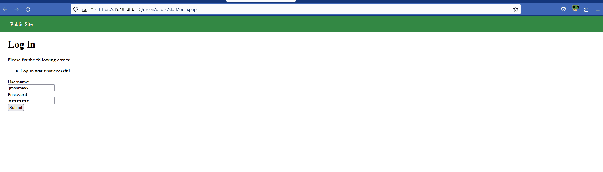
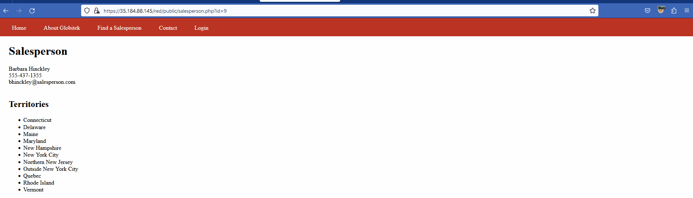
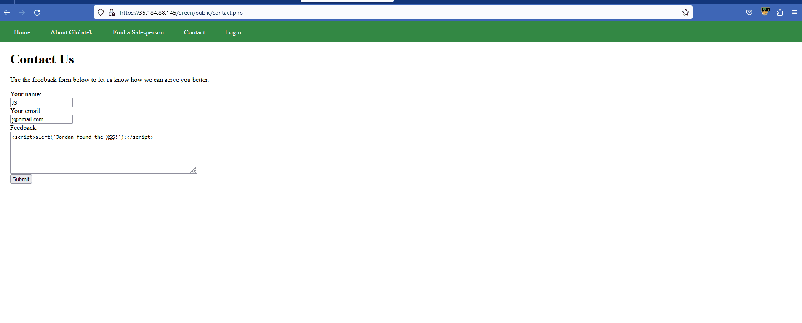

# codepath_homework
Username Enumeration

Has two separate classes for valid user versus non-valid user

IDOR

Allows you to access unlinked pages, other colors return you to the main staff screen if you input id=10

XSS

Input isn't scrubbed before being submitted

